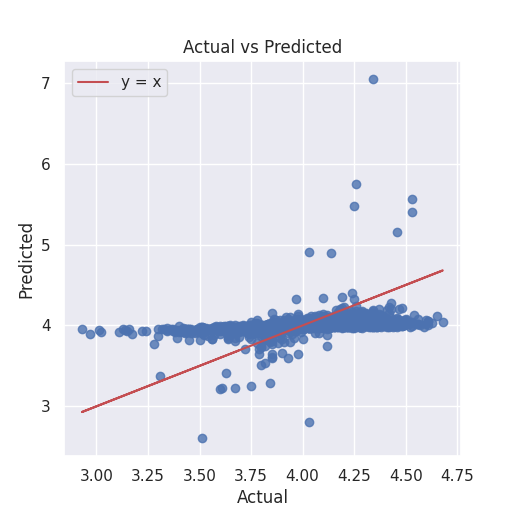

# Dataset Description

The dataset `goodreads.csv` contains information about books from Goodreads, with a total of 10,000 entries and 23 features. Key features include:

- **Identifiers**: `book_id`, `goodreads_book_id`, `best_book_id`, and `work_id`.
- **Books Information**: Includes `authors`, `original_publication_year`, `original_title`, `title`, `isbn`, and `isbn13`.
- **Ratings Data**: Features such as `average_rating`, `ratings_count`, and individual rating counts (`ratings_1` to `ratings_5`).
- **Image Links**: URLs for book cover images (`image_url`, `small_image_url`).
- **Language Information**: `language_code`.

## Statistical Analysis Summary

- **Count of Non-Missing Values**: Most features have complete data, but `isbn`, `isbn13`, `original_publication_year`, `original_title`, and `language_code` have missing values.
- **Unique Values**: Features like `authors` and `isbn` contain high variability, indicating a wide range of authors and books.
- **Duplicated Rows**: There are no duplicate rows, ensuring data integrity.
- **Correlation Analysis**: 
  - Notable correlations include strong positive relationships between various rating counts and average rating (e.g., `ratings_count` vs. `ratings_4` at 0.979).
  - Negative correlations exist between `books_count` and ratings, suggesting that books with a higher count may have diverse ratings.
  - Correlations among ratings highlight that higher ratings tend to cluster together.

# Correlation Analysis Summary

## Overview of the Analysis
The correlation analysis was conducted on a dataset from `goodreads.csv`, evaluating various factors related to book ratings, such as `books_count`, `original_publication_year`, `average_rating`, and the distribution of ratings (1-5). The analysis produced a correlation matrix and a heatmap visualization (chart_1.png).

## Key Findings

### Strong Correlations:
1. **Ratings and Average Ratings**:
   - A very strong positive correlation (0.93) exists between `ratings_5` and `average_rating`, indicating that books with a higher number of top ratings tend to have higher average ratings.
   - Conversely, there is a strong negative correlation (-0.83) between `ratings_1` and `average_rating`, highlighting that books with more low ratings often have lower overall ratings.

### Moderate Correlations:
2. **General Rating Trends**:
   - All rating categories (`ratings_1` to `ratings_5`) show moderate positive correlations with one another. This demonstrates that higher ratings generally correlate with better scores across the board.
   - The correlation between `ratings_2`, `ratings_3`, `ratings_4`, and `ratings_5` supports the trend that books with better ratings tend to excel across various rating levels.

### Weak Correlations:
3. **Publication Year Impact**:
   - `original_publication_year` exhibits weak correlations with other metrics, suggesting that the age of a book does not significantly influence its ratings, indicating that both contemporary and older books can achieve similar perceived quality.

### Reviews and Average Ratings:
4. **Reviews Count**:
   - There is a moderate positive correlation (0.61) between `work_text_reviews_count` and `average_rating`, indicating that books with a higher number of reviews typically receive better average ratings, albeit not strongly.

## Insights
- **Importance of High Ratings**: High ratings positively influence average ratings. Books should focus on strategies that encourage more five-star ratings to improve overall perception.
- **Negative Ratings Impact**: Reducing lower ratings is crucial, as they significantly detract from average ratings.
- **Publication Date**: The year of publication does not strongly determine success, suggesting that the intrinsic quality and engagement metrics are more impactful.
- **Boosting Engagement**: Fostering more positive reviews while minimizing low ratings can effectively elevate book ratings.

### Implications
These insights can inform marketing strategies, book development decisions, and reader engagement initiatives to enhance book success and popularity.

# Outlier Detection Analysis on Goodreads Dataset

## Analysis Overview
The outlier detection analysis was conducted on the `goodreads.csv` dataset, which consists of 10,000 samples. The primary objective was to identify observations that significantly deviate from the expected patterns in the data, indicative of potential anomalies or outliers.

### Analysis Results
- **Number of Anomalies Detected:** 752
- **Total Number of Samples Analyzed:** 10,000

## Insights and Interpretation
From the analysis results, approximately 7.52% of the total dataset was flagged as anomalies. This indicates that there are several data points that do not conform to the general distribution of the dataset.

### Description of Insights
The presence of 752 anomalies suggests potential issues within the dataset, such as:
- Data entry errors (e.g., unrealistic ratings or review counts)
- Unique characteristics of certain books that lie outside the common patterns (e.g., extremely high/low ratings)
- Potentially fraudulent entries, such as bot-generated reviews

## Implications of Findings
The identification of these anomalies has several implications:
- **Data Quality Improvement:** Highlighting these anomalies can drive a review of the dataset for accuracy and completeness, enhancing overall data quality.
- **Analysis Bias:** Understanding anomalies is crucial for further analyses, as these outliers can skew results and provide misleading insights.
- **Targeted Investigations:** The anomalies may necessitate deeper investigations to understand underlying reasons, which could inform decisions related to data cleaning or further research on specific segments in the dataset.

In conclusion, the anomaly detection analysis serves as a critical step in ensuring data integrity and reliability for subsequent analysis endeavors within the Goodreads dataset.

# Regression Analysis on Goodreads Data

## Analysis Overview
The regression_analysis function was applied to the dataset `goodreads.csv` to examine the relationship between various features and the target variable, `average_rating`. The analysis yielded the following key metrics:

- R² Score: 0.0506 
- Mean Absolute Error (MAE): 0.1790 
- Mean Squared Error (MSE): 0.0582 
- Root Mean Squared Error (RMSE): 0.2412 
- Coefficients: Array of feature coefficients 
- Intercept: 4.0007 

### Key Findings
1. **Model Performance**: The R² score (0.0506) indicates that only about 5.06% of the variance in `average_rating` is explained by the model, suggesting it has limited predictive capability.
  
2. **Feature Importance**: The coefficients show varying degrees of influence from the different features. For instance, `ratings_4` and `ratings_5` have positive coefficients, indicating they positively impact `average_rating`, while features like `ratings_count` and `work_ratings_count` appear to have a negative effect.

3. **Intercept**: The intercept value (4.0007) suggests that when all other features are zero, the expected average rating is around 4.00.

### Insights
- **Limited Predictive Power**: The low R² score implies that the model may need additional features or different modeling techniques for improved prediction. This indicates that other predictors not included in the analysis might be influencing average ratings.
  
- **Potential Underestimation**: The assessment of errors, especially in lower actual rating ranges, suggests potential underestimation by the model, necessitating more focus on low-rated books.

### Implications
- **Model Refinement**: There is a clear need for model enhancement through feature engineering or employing more complex algorithms to capture non-linear relationships better.
  
- **Business Decisions**: For stakeholders, understanding these relationships can inform marketing strategies and book selections to cater better to reader preferences, potentially leading to improved average ratings through targeted enhancements.

## Chart Analysis Summary

The scatter plot titled "Actual vs Predicted" reveals:
1. **Correlation**: A positive correlation between actual and predicted values is observed.
2. **Linearity**: The line of best fit (y = x) indicates a satisfactory alignment for most points.
3. **Variability**: Significant variability, particularly for lower actual values, reveals underestimation issues.
4. **Outliers**: A few points significantly deviate from the trend, showcasing limitations in prediction.
5. **Distribution of Points**: High density in specific ranges suggests the model's reliability is stronger within these clusters.

### Summary of Findings
The model exhibits a generally positive correlation, yet its predictive capabilities are limited, especially in lower ratings. Continuous improvement and potential complexity are necessary for better performance, highlighting important considerations for future analyses and applications.

