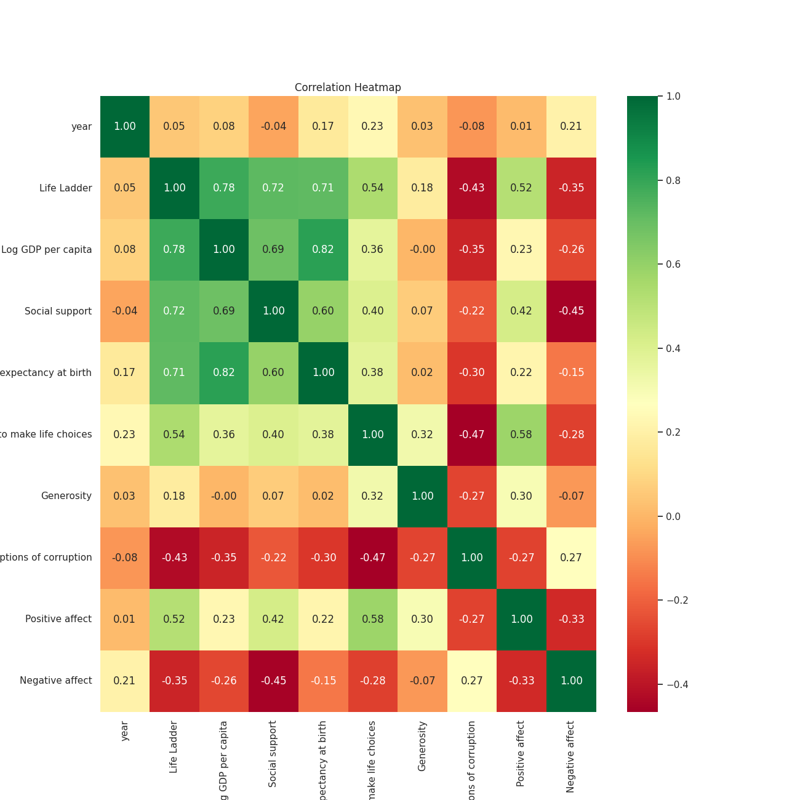
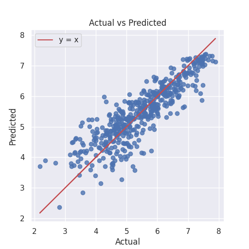
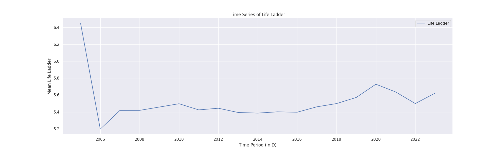

# Story of Happiness Analysis

## Introduction to the Dataset
The dataset "happiness.csv" spans several years and includes happiness indicators for 165 countries. It contains 2363 entries with 11 columns, featuring metrics like "Life Ladder," "Log GDP per capita," "Social support," "Generosity," and more. These metrics aim to quantify the subjective well-being and perceived happiness of individuals across different regions.

## Analysis Carried Out
The analysis conducted on this dataset involved several distinct approaches:

1. **Generic Analysis**: This initial exploration provided a comprehensive overview of the dataset's structure, including unique values, summary statistics, missing values, and the correlation between variables.

   

2. **Regression Analysis**: To understand the relationship between predictors and the "Life Ladder" (happiness score), a regression analysis revealed that economic (Log GDP per capita) and social factors (Social support) significantly influence happiness levels. The regression model achieved an R² score of approximately 0.76.

   

3. **Time Series Analysis**: This analysis assessed the trends of happiness scores over the years. It confirmed the stationarity of "Life Ladder" scores, indicating no long-term trend but consistent happiness levels across years.

   

4. **Dynamic Analysis**: A focused examination of numerical columns provided insights into central tendencies, skewness, and kurtosis, revealing the distribution characteristics of the happiness metrics.

## Insights Discovered
From the analyses, several critical insights emerged:

- **Economic Correlation**: Strong correlations were established between happiness levels and economic factors. The mean "Life Ladder" score of 5.47 suggests moderate happiness, closely linked to a mean "Log GDP per capita" of 9.36.
- **Distribution Characteristics**: The dynamic analysis highlighted potential skewness in the data, suggesting that while some countries experience high happiness scores, others may lag.
- **Stable Happiness Levels**: The time series analysis indicated that happiness levels have remained stable over the years, providing a consistent framework for understanding global happiness.

## Implications of Findings
These findings carry significant implications for policymakers and researchers:

1. **Targeted Interventions**: Understanding the key contributors to happiness can aid governments in devising targeted strategies aimed at improving economic conditions and social support, ultimately raising the happiness scores of their citizens.

2. **Monitoring Trends**: The stable nature of happiness levels suggests that while immediate changes may not significantly alter happiness, long-term policies focused on economic and social support might yield positive results over time.

3. **Future Research**: The identified skewness in happiness distribution could prompt further investigation into the outliers, providing deeper insights into what contributes to exceptionally high or low happiness scores in specific countries.

In conclusion, the comprehensive analysis of the happiness dataset not only enhances our understanding of the driving factors behind happiness but also equips policymakers with the necessary information to improve well-being across nations.

