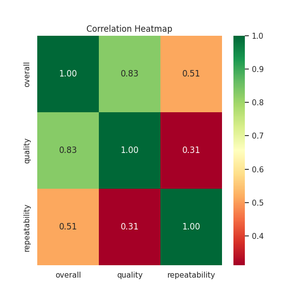
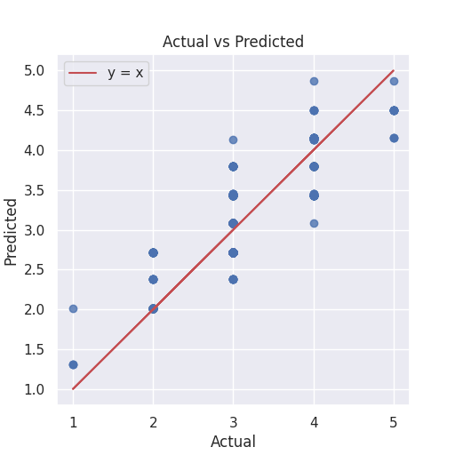
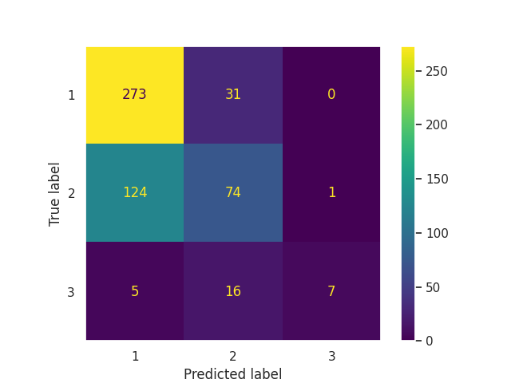

# Analysis Story: Media Review Dataset

## Dataset Overview
The dataset received is a collection of media reviews, specifically focusing on movies in the Tamil language. It contains a total of 2,652 entries with eight columns: `date`, `language`, `type`, `title`, `by`, `overall`, `quality`, and `repeatability`. The key columns of interest are `overall`, `quality`, and `repeatability`, which are numerical ratings reflecting various aspects of the movies. The dataset also has missing values, particularly in the `by` column, and includes multiple unique films and review attributes.

## Analysis Conducted
### Generic Analysis
The first step involved conducting a **generic analysis** to understand the underlying composition of the dataset. It confirmed:
- 2,652 total entries
- Key statistics for numerical columns showed an average `overall` rating of approximately 3.05.
- A notable correlation was found among the numerical ratings, particularly between `quality` and `overall`, with a correlation coefficient of 0.826.

### Time Series Analysis
Next, a **time series analysis** was performed on the `overall` rating using the `date` column. The Augmented Dickey-Fuller test indicated that the time series data is stationary, displaying no significant trend over time.

### Regression Analysis
A **regression analysis** was then conducted to predict the `overall` rating using `quality` and `repeatability` as predictors. The analysis yielded an R² score of approximately 0.745, suggesting that the model can explain a significant portion of the variability in overall ratings.

### Dynamic Analysis
Finally, a **dynamic analysis** was performed to explore the numerical columns in depth. It provided summary statistics, skewness, and kurtosis, highlighting:
- An average `quality` rating of approximately 3.21 and a `repeatability` rating skewed to the right.

## Insights Discovered
The analysis revealed several key insights:
- The media exhibits a generally positive reception overall, indicated by average ratings above 3.
- The strong correlation between `quality` and `overall` suggests that improving the quality of the media can directly influence overall ratings.
- The dynamic analysis highlighted skewness in the repeatability ratings, indicating that while most movies are rated similarly, a handful have notably higher repeatability scores.

## Implications of Findings
The insights from this analysis have several implications:
1. **Quality Improvement**: Media producers should focus on enhancing the quality of their films, as this is closely linked to higher overall ratings.
2. **Targeted Marketing**: Identifying films with high repeatability ratings can guide marketing strategies to promote these films as viewer favorites.
3. **Future Releases**: The insights can inform future production decisions, encouraging filmmakers to adopt elements that have led to higher appeal in previously successful films.

In conclusion, the analysis of the media review dataset provides a detailed understanding of audience preferences and suggests actionable pathways for enhancing media content and viewer engagement.

