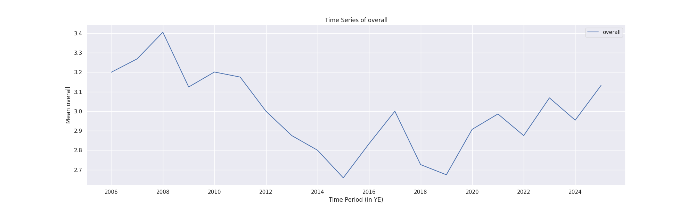

# Story of the Analysis

## Dataset Overview
The dataset received is comprised of media review data, containing 2,652 entries across eight columns. These columns include various attributes such as the date of the review, language, type of media (e.g., movie), title of the media, the reviewers' names, and ratings. The numerical columns include ratings for overall quality and repeatability, while the categorical sections provide context about the media and the reviewers. 

## Analysis Conducted
### Generic Analysis
The initial analysis conducted was a generic analysis, which provided insight into the structure and content of the dataset. Key findings included:

- **Column Names**: date, language, type, title, by, overall, quality, repeatability
- **Missing Values**: Notably, the 'by' column had 262 missing entries.
- **Outlier Detection**: Identified 725 anomalies within the dataset, indicating areas that required further exploration.
- **Correlation Matrix**: High correlation was found between 'overall' and 'quality'.

### Time Series Analysis
A time series analysis was performed focusing on the overall ratings across time. The results showed that the ratings were stationary, as indicated by the Augmented Dickey-Fuller (ADF) test where the p-value was significantly low.

### Classification Analysis
The classification analysis targeted the 'quality' ratings, revealing insights into the predictive performance regarding this attribute with various precision levels for each class.

### Dynamic Analysis
Finally, a dynamic analysis was executed to evaluate numerical columns exclusively. The results highlighted standardized metrics such as mean (close to zero), standard deviation (around one), minimum, and maximum values after handling missing entries.

## Insights Discovered
1. **Strong Relationships**: The correlation matrix indicated a robust relationship between overall ratings and quality, suggesting improvements in one may enhance the other.
2. **Temporal Stability**: The time series analysis revealed that the overall ratings were consistently stable over time, pointing to reliability in user reviews.
3. **Predictive Patterns**: The classification analysis provided a clear view of how well various media types and attributes could predict quality ratings, detailing strengths and weaknesses in reviewer accuracy.
4. **Standardized Performance**: Dynamic analysis showed that all numerical features were well-centered and scaled. This suggests that they can be reliably used for predictive modeling.

## Implications of Findings
The insights gleaned from this analysis have several implications:

- **Improvement Initiatives**: Media creators and marketers can use the correlation insights to focus on enhancing quality ratings, which in turn may boost overall ratings.
- **User Engagement Strategies**: Since the reviews show stability over time, strategies aimed at user engagement can be formulated without fear of overly volatile response patterns.
- **Predictive Modeling**: The classification findings allow for the development of predictive models that can help audiences find media that may interest them based on their previous ratings.
- **Data Integrity Actions**: The presence of missing values and anomalies suggests a need for improved data collection methods or data cleansing strategies to ensure higher data quality in future analyses.

Overall, this analysis lays the groundwork for deeper insights into media performance and can serve as a foundational tool for data-driven decision-making in the media industry.
